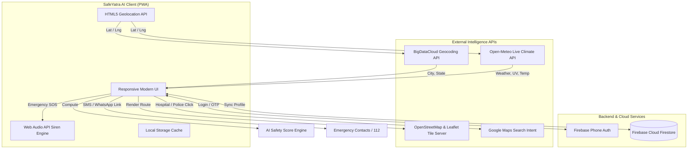

# 🛡️ SafeYatra AI - Smart Tourist Safety Companion
## Complete Project Documentation & Presentation (PPT) Blueprint

> **Document Type:** Project Presentation & Viva Guide  
> **Project Name:** SafeYatra AI  
> **Target Audience:** Evaluators, Hackathon Judges, Academic Reviewers & Investors  

---

## 📌 Table of Contents
1. [Executive Summary](#1-executive-summary)
2. [Problem Statement & Background](#2-problem-statement--background)
3. [Project Goals & Objectives](#3-project-goals--objectives)
4. [Technology Stack & Software Tools Used](#4-technology-stack--software-tools-used)
5. [System Architecture & Data Flow](#5-system-architecture--data-flow)
6. [Core Modules & Key Features](#6-core-modules--key-features)
7. [AI Risk Scoring & Dynamic Decision Algorithms](#7-ai-risk-scoring--dynamic-decision-algorithms)
8. [Slide-by-Slide Ready-to-Use PPT Blueprint (15 Slides)](#8-slide-by-slide-ready-to-use-ppt-blueprint-15-slides)
9. [Key Highlights, Competitive Advantages & Social Impact](#9-key-highlights-competitive-advantages--social-impact)
10. [Future Scope & Roadmap](#10-future-scope--roadmap)
11. [Frequently Asked Questions (Viva / Judge Q&A Preparation)](#11-frequently-asked-questions-viva--judge-qa-preparation)

---

## 1. Executive Summary

**SafeYatra AI** is an advanced, lightweight, Progressive Web Application (PWA) designed to safeguard tourists and travelers in real time. It blends dynamic AI safety scoring, live climate analytics, geofenced risk advisories, instant Google Maps emergency discovery, and a 24/7 SOS command center into an intuitive, high-performance mobile-first platform.

- **Tagline:** *Your AI-Powered Travel Safety & Emergency Companion*
- **Platform:** Progressive Web App (PWA) / Responsive Web / Android (via TWA / Bubblewrap)
- **Deployment Status:** Zero-dependency client build, Cloud Firestore synchronized, ready for live usage.

---

## 2. Problem Statement & Background

### The Challenges Faced by Travelers:
1. **Unfamiliarity with Local Geography:** Travelers often cannot gauge which neighborhoods or routes are prone to theft, scams, or isolation.
2. **Delayed Emergency Response:** In stressful situations, finding emergency numbers (Police, Ambulance, Women Helpline) and conveying exact GPS coordinates takes critical minutes.
3. **Severe Weather & Climate Hazards:** Sudden flash floods, heatwaves, heavy downpours, or extreme UV exposure can turn vacations into life-threatening situations without proactive advisories.
4. **Language & Communication Barriers:** Foreign or out-of-state tourists often face friction while locating verified hospitals or police stations in an emergency.
5. **Lack of Centralized Tourist Identity & Medical Details:** In accidents, first responders lack access to vital medical parameters (blood group, allergies, emergency contacts).

### The SafeYatra AI Solution:
A zero-friction, always-available digital safety shield that analyzes user coordinates, assesses local risk indices, delivers actionable packing/weather insights, and triggers 1-tap SOS workflows with live GPS dispatch.

---

## 3. Project Goals & Objectives

### Primary Objectives:
- **Real-Time Safety Scoring:** Deliver an explainable 0–100 Safety Index computed dynamically using local crime rates, weather hazards, and terrain risks.
- **Rapid 1-Tap SOS Dispatch:** Enable a high-speed emergency hub with a 3-second fail-safe hold timer, Web Audio acoustic alarm, fake incoming escape call, and instant GPS sharing via SMS/WhatsApp.
- **Seamless Emergency Facility Discovery:** Direct integration with Google Maps to locate verified nearby **Police Stations** and **Hospitals** biased to user coordinates without requiring costly proprietary APIs.
- **Hyper-Local Climate & Packing Intelligence:** Provide real-time hourly and 7-day forecasts, UV alerts, and dynamic wardrobe/gear suggestions.
- **Digital Tourist Identity:** Secure storage of tourist medical information and emergency contacts accessible during distress.

### Non-Functional Objectives:
- **Sub-second Latency:** Fast UI loading via client-side caching (`localStorage` + Service Worker).
- **Privacy & Security:** Location coordinates are processed on-demand and never sold.
- **Offline & Low-Bandwidth Resilience:** PWA architecture ensures critical emergency features function in poor network zones.

---

## 4. Technology Stack & Software Tools Used

| Layer / Component | Technology / Library | Role & Purpose |
| :--- | :--- | :--- |
| **Frontend UI / Markup** | **HTML5 (Semantic)** | Accessible structure, PWA manifest tags, Web Audio elements |
| **Styling & Design System** | **CSS3 (Vanilla)** | Glassmorphism, CSS Grid, Flexbox, Keyframe Animations, Color Tokens |
| **Client-Side Logic** | **Modern JavaScript (ES6+)** | Asynchronous APIs (`async/await`, `fetch`), DOM Manipulation |
| **Cloud Database** | **Firebase Cloud Firestore** | NoSQL document storage for user profiles and emergency contact details |
| **Authentication** | **Firebase Phone Auth (OTP)** | Secure phone-based verification with reCAPTCHA fraud prevention |
| **Mapping & Routing** | **Leaflet.js & OpenStreetMap** | Lightweight interactive map rendering, custom markers, polylines |
| **Emergency Navigation** | **Google Maps Geolocation Intent** | Native Google Maps search for nearby Police Stations and Hospitals |
| **Live Weather API** | **Open-Meteo API** | Free, high-accuracy global weather forecast, UV index, and WMO weather codes |
| **Reverse Geocoding** | **BigDataCloud API** | Fast, client-side reverse geocoding from GPS coordinates to City/State |
| **Acoustic Synthesizer** | **Web Audio API** | Generates high-pitch alarm siren in-browser without external audio files |
| **Icons & Visuals** | **FontAwesome 6 Pro / Free** | Consistent iconography for safety alerts, status tags, and action buttons |
| **PWA & Offline Support** | **Service Workers (`sw.js`) + Manifest** | Installable on iOS/Android, cache-first network fallback, app shortcuts |
| **Development & Tools** | **VS Code / Antigravity IDE, Git** | Version control, live debugging, automated builds |

---

## 5. System Architecture & Data Flow

---

## 6. Core Modules & Key Features

### 🟢 Module 1: AI Safety Score & Dynamic Risk Index
- **Visual Presentation:** Donut progress ring with animated SVG stroke calculations.
- **Multi-Factor Breakdown:**
  - **Crime Level Risk (40% Weight):** Evaluates regional safety statistics.
  - **Weather Hazard Risk (35% Weight):** Evaluates storm severity, rain probability, heat index, and visibility.
  - **Terrain & Time Risk (25% Weight):** Factoring night hours and remote coordinates.
- **Dynamic Greeting:** Time-of-day contextual greeting (*Good morning 🌅 / Good afternoon ☀️ / Good evening 🌙*).

### 🚨 Module 2: 24/7 Emergency & SOS Hub
- **3-Second Fail-Safe Hold Button:** Prevents accidental triggers with an animated radial timer.
- **Instant Web Audio Alarm Siren:** High-pitch synthesized oscillator alarm that deters attackers and attracts attention even without internet.
- **Simulated Fake Call Feature:** Realistic incoming call UI with active timer screen allowing users to gracefully escape dangerous or uncomfortable situations.
- **One-Tap Emergency SMS / WhatsApp:** Pre-drafted SOS dispatch message including live Google Maps GPS pin:
  `"EMERGENCY! I need immediate help. My current GPS Location: https://maps.google.com/?q=LAT,LNG"`
- **Digital Medical ID Card:** Pop-up modal displaying blood group, allergies, emergency contacts, and medical history for emergency responders.
- **Direct National Dials:** 1-tap call links to 112 (National Emergency), 100 (Police), 108 (Ambulance), 1091 (Women Helpline), 1363 (Tourist Helpline).

### 📍 Module 3: Google Maps Emergency Discovery
- **Hospital Search:** Direct link opening Google Maps with `near=lat,lng` query to find verified trauma centers and medical emergency rooms.
- **Police Station Search:** Direct link querying nearby active police stations and check-posts.
- **Fallback Grace:** Automatic graceful degradation if GPS permissions are denied.

### ☀️ Module 4: Live Climate & Travel Advisory Engine
- **Hyper-Local Current Weather:** Real-time temperature, condition label, high/low, feels-like metrics.
- **Granular Atmospheric Metrics:** UV Index badge, Wind speed/direction, Humidity, Precipitation probability, Visibility (km), Air pressure, Sunrise & Sunset times.
- **Hourly & 7-Day Extended Forecasts:** Visual temperature curves and condition trends.
- **AI Smart Packing Assistant:** Recommends clothing, hydration goals, and travel gear (e.g., UV sunglasses, umbrella, winter thermal wear).

### 🔔 Module 5: Dynamic Geo-Advisories & Safety Alerts
- **Filterable Alert Feed:** Categories for *All, Security/Threat, Weather Alerts, Scams/Tourist Traps, Health/Advisories*.
- **Severity Tagging:** Critical (Red), Warning (Amber), Info (Blue).
- **Advisory Modal:** Detailed situation reports with actionable prevention advice (*e.g., "Use verified prepaid taxi booths", "Avoid deserted alleys after 10 PM"*).

### 🗺️ Module 6: Interactive Leaflet Map & Safe Zones
- **Real-Time Marker:** User location pinpointed with accuracy radius circle.
- **Safe Route Polylines:** Visualizes recommended well-lit tourist corridors.
- **Offline OpenStreetMap Tiles:** Fast, reliable open-source mapping.

### 👤 Module 7: Firebase Authentication & Profile Management
- **Phone OTP Login:** Fast login experience without passwords.
- **Firestore Profile Synchronization:** Securely binds user emergency contacts, age, blood group, and address.
- **Auth Guard:** Prevents unauthorized access to sensitive tourist safety features.

---

## 7. AI Risk Scoring & Dynamic Decision Algorithms

SafeYatra AI calculates an explainable composite safety score between **0 and 100** using the following weighted mathematical model:

$$\text{Safety Score} = 100 - \left( 0.40 \times \text{Crime Risk} + 0.35 \times \text{Weather Risk} + 0.25 \times \text{Terrain/Time Risk} \right)$$

### Rating Thresholds:
- **85 – 100:** 🟢 **Safe & Secure** (Ideal for travel and exploration)
- **60 – 84:** 🟡 **Moderate Caution** (Standard vigilance recommended)
- **0 – 59:** 🔴 **High Alert** (Advisories active; avoid solitary travel)

---

## 8. Slide-by-Slide Ready-to-Use PPT Blueprint (15 Slides)

Here is the exact structure you can copy into PowerPoint, Google Slides, or Canva:

---

### 🖥️ Slide 1: Title Slide
- **Slide Title:** SafeYatra AI
- **Subtitle:** Smart Tourist Safety, Real-Time Geo-Advisories & Emergency SOS Companion
- **Presenter Name & Team:** [Your Name / Team Details]
- **Date & Event:** [College Project / Hackathon / Semester Presentation 2026]
- **Visuals:** SafeYatra logo, smartphone mockup showing the main dashboard.

---

### 🖥️ Slide 2: Problem Statement & Motivation
- **Header:** The Vulnerability of Modern Travelers
- **Bullet Points:**
  - Unfamiliar territory leads to increased vulnerability to crimes and scams.
  - Delay in emergency response due to lack of immediate local contact access.
  - Sudden extreme weather changes impact travel plans and personal safety.
  - Absence of a quick, centralized digital emergency card for first responders.
- **Key Takeaway:** *Safety shouldn't be an afterthought; it must be real-time, proactive, and accessible in 1 tap.*

---

### 🖥️ Slide 3: SafeYatra AI - Solution Overview
- **Header:** Introducing Your Personal AI Travel Guardian
- **Bullet Points:**
  - **All-in-One Safety Hub:** Safety score, SOS, weather intelligence, and live maps in a single lightweight app.
  - **Proactive rather than Reactive:** Delivers safety alerts *before* incidents happen.
  - **Zero-Barrier Access:** Works as an installable PWA on any smartphone with zero app-store download friction.

---

### 🖥️ Slide 4: Technology Architecture & Stack
- **Header:** Robust, Lightweight & Scalable Tech Stack
- **Content Blocks:**
  - **Frontend:** Semantic HTML5, Vanilla CSS3 (Glassmorphism), Vanilla JavaScript ES6+.
  - **Backend & Cloud:** Firebase Phone Authentication + Cloud Firestore.
  - **Mapping & Geolocation:** Leaflet.js, OpenStreetMap, Google Maps Intent API.
  - **Data Providers:** Open-Meteo API (Weather/UV), BigDataCloud API (Geocoding).
  - **Audio Engine:** Web Audio API (Synthesized Alarm Siren).

---

### 🖥️ Slide 5: Feature 1 - Dynamic AI Safety Score
- **Header:** Real-Time AI Safety Score Engine
- **Bullet Points:**
  - Dynamic 0–100 score updated as the tourist moves between locations.
  - Analyzes multi-dimensional risks: Crime level, Severe climate index, and Terrain/Night factors.
  - Visual donut progress indicator with instant high-level status (*"Area Safe" / "Exercise Caution"*).
- **Visual:** Screenshot of the Main Dashboard & Donut Ring.

---

### 🖥️ Slide 6: Feature 2 - 24/7 Emergency SOS Hub
- **Header:** Life-Saving SOS in Under 3 Seconds
- **Bullet Points:**
  - **3-Second Hold Activation:** Eliminates accidental triggers while ensuring rapid emergency dispatch.
  - **Web Audio Alarm Siren:** High-decibel sound synthesizer generated in-browser to scare attackers and attract help.
  - **1-Tap Direct Emergency Calling:** Pre-configured for 112 (National Emergency), 100 (Police), 108 (Ambulance), 1091 (Women Helpline).
- **Visual:** Screenshot of the SOS Screen & 3-second hold button.

---

### 🖥️ Slide 7: Feature 3 - Fake Call & Escape Utilities
- **Header:** Discrete Escape Mechanisms for High-Risk Situations
- **Bullet Points:**
  - **Simulated Incoming Call:** Realistic call simulation with ringtone, accept/decline buttons, and live in-call timer.
  - **Purpose:** Allows solo travelers (especially women) to gracefully extract themselves from uncomfortable conversations, suspicious cabs, or dark alleys.
  - **Instant Live GPS Sharing:** Direct WhatsApp / SMS trigger with clickable Google Maps pin.
- **Visual:** Screenshot of the Fake Call UI.

---

### 🖥️ Slide 8: Feature 4 - Google Maps Emergency Services
- **Header:** Instant Hospital & Police Station Discovery
- **Bullet Points:**
  - Seamless 1-click discovery of nearest verified **Police Stations** and **Hospitals**.
  - Automatically queries Google Maps with high-accuracy user coordinates (`&near=lat,lng`).
  - No expensive API keys required; leverages native mobile map applications.
- **Visual:** Diagram showing click-to-navigation flow.

---

### 🖥️ Slide 9: Feature 5 - Live Weather & Climate Advisory
- **Header:** Proactive Meteorological Safety
- **Bullet Points:**
  - Real-time temperature, condition, humidity, wind, and UV index monitoring.
  - Hourly forecast track + 7-day weather outlook.
  - **Smart Packing Assistant:** AI recommends clothing, hydration, and gear based on live weather data.
- **Visual:** Screenshot of the Weather Dashboard and Hourly Forecast Cards.

---

### 🖥️ Slide 10: Feature 6 - Real-Time Geo-Advisories & Alerts
- **Header:** Location-Aware Safety Feed
- **Bullet Points:**
  - Color-coded severity tiers: Critical (Red), Warning (Amber), Info (Blue).
  - Categorized filters: Security, Weather, Tourist Scams, and Health advisories.
  - Detailed advisory modals with actionable preventive steps for travelers.
- **Visual:** Screenshot of the Alerts Page and Advisory Modal.

---

### 🖥️ Slide 11: Feature 7 - Digital Medical ID & Tourist Profile
- **Header:** First-Responder Medical Identification
- **Bullet Points:**
  - Stores vital medical information: Blood group, known allergies, age, emergency contact.
  - Accessible directly from the SOS hub for paramedics and good Samaritans during an accident.
  - Firebase Cloud Firestore synchronization with offline local storage cache.
- **Visual:** Screenshot of the Profile Page and Medical ID Modal.

---

### 🖥️ Slide 12: Progressive Web App (PWA) Capabilities
- **Header:** Built for Accessibility & Offline Resilience
- **Bullet Points:**
  - **Service Worker (`sw.js`):** Caches essential assets for instant loading in low-connectivity areas.
  - **Web Manifest:** Enables "Add to Home Screen" on Android and iOS with native app icon and splash screen.
  - **Quick Shortcuts:** Direct home-screen access to SOS, Weather, Alerts, and Map.
  - **Lightweight:** Fast loading with minimal battery consumption.

---

### 🖥️ Slide 13: Social Impact & Target Market
- **Header:** Real-World Value & Target Beneficiaries
- **Bullet Points:**
  - **Solo & Women Travelers:** Increased confidence and discrete safety tools.
  - **International & Domestic Tourists:** Overcomes language barriers during emergencies.
  - **Adventure & Trekking Enthusiasts:** Weather hazard warnings and rapid coordinate dispatch.
  - **Tourism Departments:** Boosts destination trust and traveler satisfaction.

---

### 🖥️ Slide 14: Future Enhancements
- **Header:** Roadmap for SafeYatra AI 2.0
- **Bullet Points:**
  - **AI Computer Vision Hazard Detection:** Camera integration to detect suspicious activity or unsafe road conditions.
  - **Multilingual Voice Assistant:** Multilingual voice-activated SOS (*"Help SafeYatra"*).
  - **IoT Wearable Integration:** Heart rate spike and fall detection trigger for SOS.
  - **Government Tourism API Integration:** Direct handshake with state police control rooms.

---

### 🖥️ Slide 15: Conclusion & Thank You
- **Header:** SafeYatra AI - Empowering Safe Journeys
- **Key Takeaways:**
  - Lightweight, full-stack, real-time safety ecosystem.
  - Combines AI risk prediction with practical emergency tools.
  - Zero barriers to adoption.
- **Q&A Invitation:** *"Thank you! We are open to questions and suggestions."*
- **Contact Info & GitHub Repo Link:** [Your Links]

---

## 9. Key Highlights, Competitive Advantages & Social Impact

| Feature | Standard Navigation (e.g. Google Maps) | SafeYatra AI |
| :--- | :--- | :--- |
| **Safety Risk Score** | ❌ No safety or crime index | ✅ Dynamic 0-100 composite safety score |
| **Emergency SOS Hub** | ❌ None | ✅ 3-sec hold SOS, alarm siren, fake call, medical ID |
| **Tourist Scams Alert** | ❌ No tourist trap warnings | ✅ Location-specific scam and security advisories |
| **AI Travel Wardrobe & Gear** | ❌ Basic weather only | ✅ Weather-adaptive smart packing suggestions |
| **Emergency Contact Dispatch** | ❌ Manual typing required | ✅ 1-tap SMS/WhatsApp dispatch with live GPS pin |
| **Installation Friction** | ❌ Heavy app store download | ✅ Instant PWA install with home-screen shortcuts |

---

## 10. Future Scope & Roadmap

1. **Multilingual Voice-Activated SOS:** Supporting Hindi, Tamil, Bengali, French, Spanish, and English voice triggers.
2. **Community Safe-Zone Crowdsourcing:** Verified tourist reviews on street lighting, night safety, and police presence.
3. **Geo-Fencing Travel Alerts:** Automatic SMS notification sent to family members when entering a high-risk zone.
4. **Offline Bluetooth Mesh SOS:** Enabling peer-to-peer distress beacons when cellular network is completely unavailable in remote valleys.

---

## 11. Frequently Asked Questions (Viva / Judge Q&A Preparation)

#### Q1: How does SafeYatra AI calculate the Safety Score?
> **Answer:** The system uses a weighted multi-factor formula combining regional crime statistics (40%), real-time atmospheric hazards from Open-Meteo (35%), and terrain/time-of-day risk parameters (25%).

#### Q2: How does the siren work if there is no internet?
> **Answer:** The siren uses the browser's native **Web Audio API** (`AudioContext`). It synthesizes sound frequencies directly on the device hardware using oscillators without downloading any audio file.

#### Q3: Why use a Progressive Web App (PWA) instead of a native mobile app?
> **Answer:** PWAs eliminate the need to download large APKs from app stores, work across both Android and iOS, provide offline caching via Service Workers, and can still be converted to a native Android APK using Google Bubblewrap / TWA.

#### Q4: How is user privacy protected?
> **Answer:** GPS coordinates are read on-device solely to query weather and emergency locations. SafeYatra AI does not sell tracking data or broadcast live positions without the user explicitly pressing the SOS button.

#### Q5: How do the Google Maps Police and Hospital integrations work?
> **Answer:** When clicked, SafeYatra AI fetches the user's current high-accuracy latitude and longitude, formats a search URL (`https://www.google.com/maps/search/?api=1&query=police+station&near=lat,lng`), and opens Google Maps directly centered on the user's location.

---

*Document created and formatted for SafeYatra AI Project Showcase & PPT Creation.*
